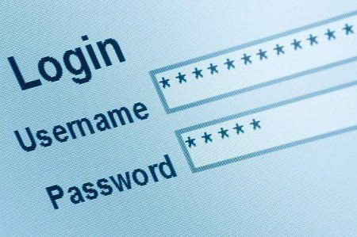
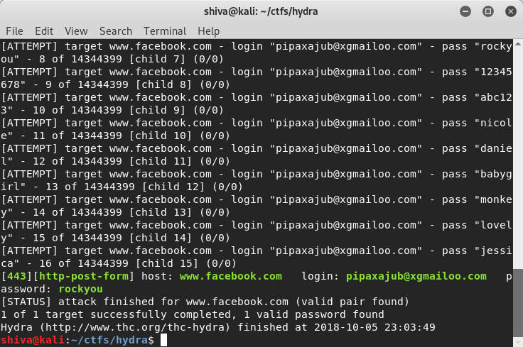
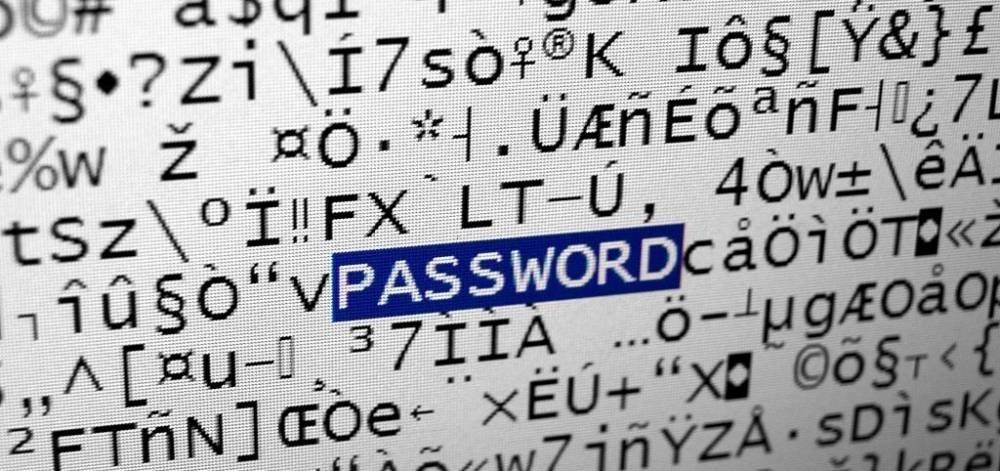
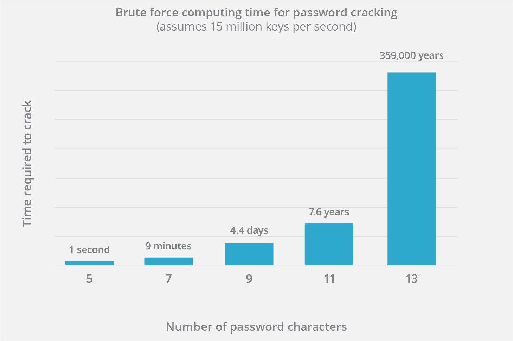

# BRUTE FORCE ATTACK

Un ataque de fuerza bruta consiste en que un atacante envía muchas contraseñas o frases de contraseña con la esperanza de adivinarlas correctamente. El atacante verifica sistemáticamente todas las contraseñas y frases de contraseña posibles hasta encontrar la correcta. Alternativamente, el atacante puede intentar adivinar la clave que normalmente se crea a partir de la contraseña utilizando una función de derivación de clave . Esto se conoce como búsqueda exhaustiva de claves.

Puede usarse para intentar descifrar cualquier dato cifrado (excepto los datos cifrados de una manera teóricamente segura). Tal ataque podría usarse cuando no es posible aprovechar otras debilidades en un sistema de encriptación (si las hay) que facilitarían la tarea.

Al adivinar contraseñas, este método es muy rápido cuando se usa para verificar todas las contraseñas cortas, pero para contraseñas más largas, se usan otros métodos, como el ataque de diccionario, porque una búsqueda de fuerza bruta lleva demasiado tiempo. Las contraseñas, frases de contraseña y claves más largas tienen más valores posibles, lo que las hace exponencialmente más difíciles de descifrar que las más cortas.

##### ACTUALIZAR CONTRASEÑAS

Algunos entornos corporativos requieren que los usuarios cambien las contraseñas cada 90 días o tal vez incluso cada 30 días. La razón detrás de esto es que un atacante que esta intentando un ataque de fuerza bruta contra una contraseña compleja necesitaría semanas para tener éxito. Si la contraseña cambia durante ese periodo de tiempo el atacante deberá comenzar de nuevo.Sin embargo como muchos usuarios confiesan estos estrictos requisitos de contraseña pueden ser contraproducentes ya que los usuarios eligen contraseñas secuenciales mas débiles.Un atacante intentaría rápidamente incrementar la contraseña.

##### MONITOREO DE ANOMALÍAS

Finalmente una organización consciente de la seguridad debe monitorear las cuentas de los usuarios para detectar anomalías,como inicios de sesión desde dispositivos o ubicaciones no reconocidas o fallos de inicio de sesión repetidos.

Contra sistemas simples,los ataques de diccionario y los ataques de fuerza bruta son formas fáciles y garantizadas en la puerta principal.En entornos mas sofisticados estos ataques solo son útiles cuando los intentos pueden combinarse con la actividad normal o dirigirse a una base de datos de contraseñas fuera de linea para descifrar hashes de contraseñas.

Como resultado de la tendencia actual de requerir contraseñas más largas y claves de encriptación, los ataques de fuerza bruta son mucho más difíciles. Cuando se utilizan contraseñas y encriptaciones adecuadas, los atacantes suelen probar otros métodos de descifrado de código, como la ingeniería social o ataques en ruta.

