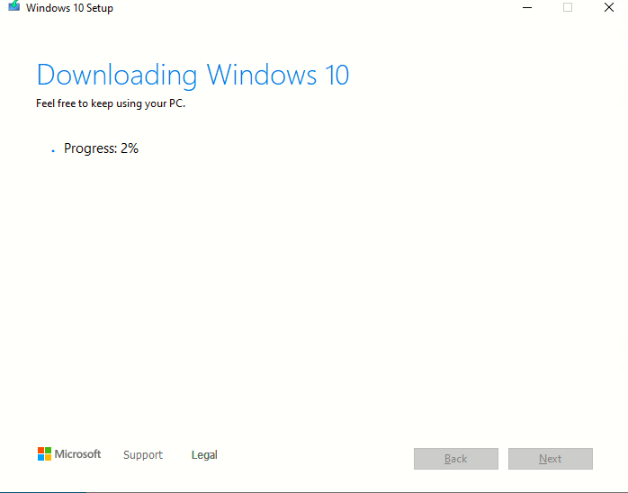

# Instalando Windows 10
#### Esta es mi experiencia instalando windows 10 en Virtual box

###### 25 de Noviembre de 2022

------

## Paso 1
Descargamos el fichero ISO de la herramienta
``windows creation tools``

Descargada de este enlace: [pincha aqui](https://www.microsoft.com/es-es/software-download/windows10).

Al iniciar el programa MediaCreationTools

Aparece el siguiente asistente

Aceptamos el acuerdo de licencia: 

Seleccionamos ``Create installation media (USB flash drive, DVD, or ISO file) for another PC``

Hasta aqui, la creación del fichero ISO y ya podremos utilizarlo en virtualBox para crear nuestra maquina virtual de Windows 10.

# Paso 2

### Instalamos Centos

Primero de todo, lo que tenemos que hacer es descargar la ISO desde la web de CentOS. 

Encontraremos la ISO en:

[Pinchar aqui](https://www.centos.org/download/)

**Descargaremos la Centos Linux DVD ISO**

Una vez descargada la ISO la montaremos en nuestra máquina virtual o pc y arrancamos desde la ISO.

Pulsaremos en Install CentOS Linux 8.

# Paso 3

### Instalamos Windows Server 2019

Primero de todo, lo que tenemos que hacer es descargar la ISO desde la web de Windows. 

Encontraremos la ISO en:

[Pinchar aqui](https://www.microsoft.com/es-es/evalcenter/download-windows-server-2019)

**Descargaremos la ISO de Windows Server 2019**

Una vez descargada la ISO la montaremos en nuestra máquina virtual o pc y arrancamos desde la ISO.

