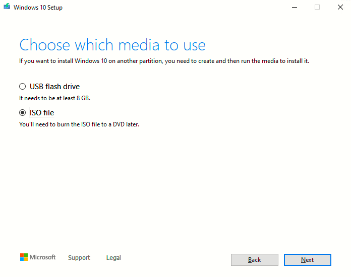
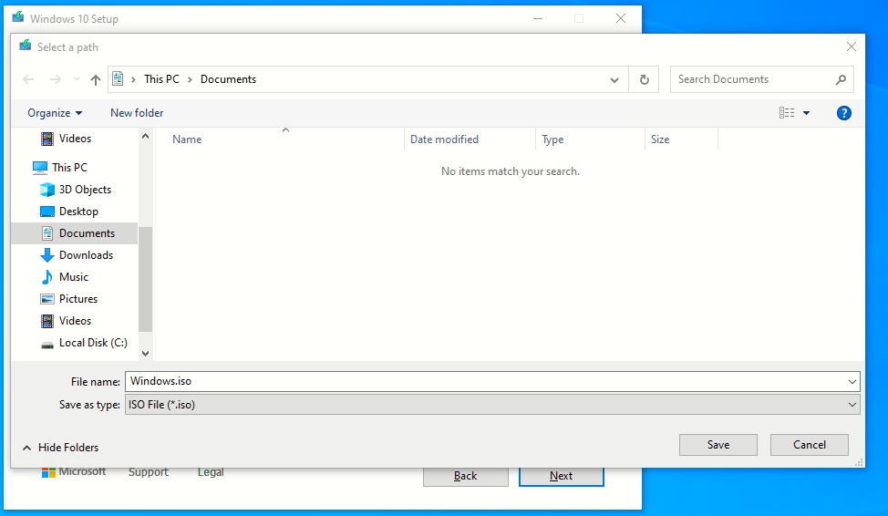

# Instalando Windows 10
#### Esta es mi experiencia instalando windows 10 en Virtual box

###### 25 de Noviembre de 2022

------

## Paso 1
Descargamos el fichero ISO de la herramienta
``windows creation tools``

Descargada de este enlace: [pincha aqui](https://www.microsoft.com/es-es/software-download/windows10).

Al iniciar el programa MediaCreationTools

Aparece el siguiente asistente

Aceptamos el acuerdo de licencia: 

Seleccionamos ``Create installation media (USB flash drive, DVD, or ISO file) for another PC``

Hasta aqui, la creación del fichero ISO y ya podremos utilizarlo en virtualBox para crear nuestra maquina virtual de Windows 10.
