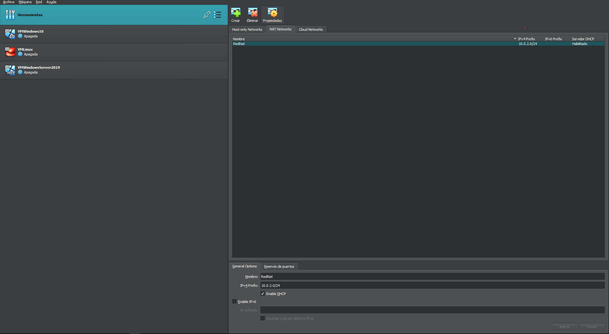
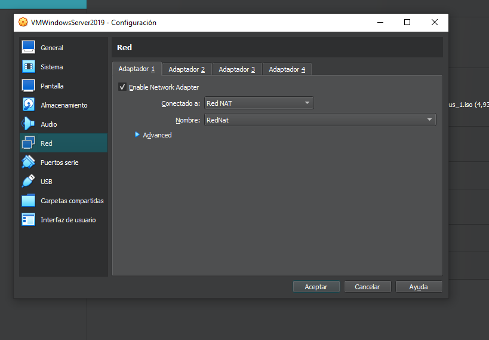
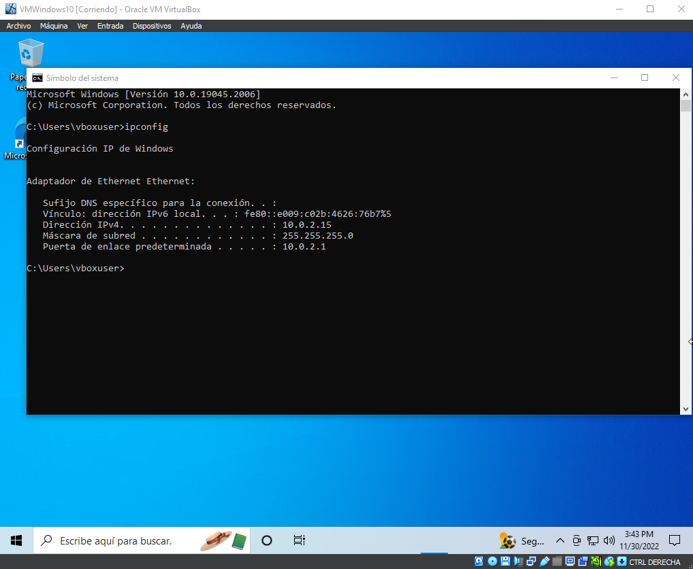
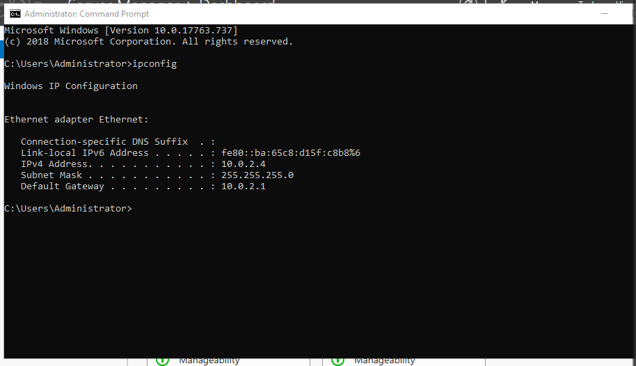
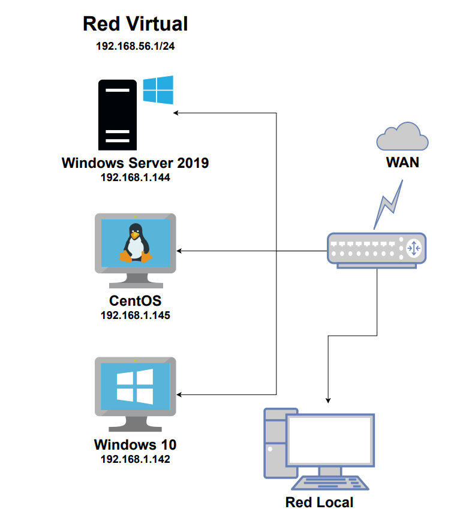

# CONFIGURACIÓN DE RED NAT ENTRE MÁQUINAS VIRTUALES

###### COMO CONECTAR 3 MAQUINAS VIRTUALES DENTRO DE UNA RED NAT

### PASO 1

Para ello tenemos que crear una red NAT en el VirtualBox.
Dentro de VirtualBox nos vamos a Archivo  luego a  Herramientas y le damos a Network Manager.

Después abrimos la pestaña NAT Networks y creamos una nueva red.

Ya tenemos la red NAT creada, ahora hay que asignársela a las tres máquinas.
Seleccionamos la máquina, abrimos su configuración y dentro de red cambiamos el adaptador 1 de NAT a red NAT y así con todas.

### PASO 2

Comprobar la nueva red que les hemos asignado con *ipconfig* y *ifconfig*.

#### WINDOWS 10

WINDOWS SERVER 2019

# Adaptador Puente

